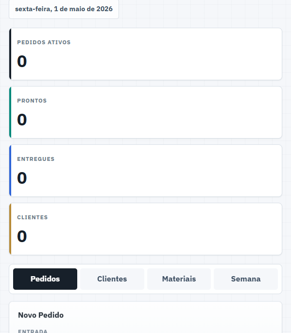

# JC Lavanderia - Sistema de Pedidos

Sistema web para gestao operacional da JC Lavanderia, com cadastro de clientes, cadastro de materiais/servicos, criacao de pedidos com itens, acompanhamento de status e visao semanal dos pedidos. O projeto usa uma API REST em ASP.NET Core 10, frontend SPA em HTML/CSS/JavaScript puro e banco de dados MySQL.

## Screenshot



## Tecnologias Usadas

| Camada | Tecnologia |
|--------|------------|
| Backend | ASP.NET Core 10 |
| Linguagem | C# |
| ORM | Entity Framework Core 10 |
| Provider MySQL | MySql.EntityFrameworkCore |
| Banco de dados | MySQL 8.0+ com InnoDB |
| Frontend | HTML5, CSS3 e JavaScript puro |
| API | REST |
| Documentacao da API | OpenAPI em ambiente de desenvolvimento |

## Funcionalidades

- Cadastro, listagem, edicao e exclusao de clientes.
- Cadastro, listagem e exclusao de materiais/servicos.
- Criacao de pedidos vinculados a um cliente.
- Inclusao de multiplos itens em cada pedido.
- Listagem paginada de pedidos, clientes e materiais.
- Filtros por status e cliente nos pedidos.
- Atualizacao controlada do status do pedido.
- Dashboard com indicadores operacionais.
- Visao semanal dos pedidos.
- Interface responsiva para desktop e mobile.

## Pre-requisitos

Antes de rodar o projeto, instale:

- .NET 10 SDK
- Git

Confirme se o .NET esta instalado:

```bash
dotnet --version
```

Em desenvolvimento, o proprio projeto baixa e inicia um MySQL local portatil na pasta `.mysql` quando voce roda `dotnet run`.

## Como Rodar o Projeto

### 1. Clonar o repositorio

```bash
git clone https://github.com/carl0scmd/JCLavanderia.git
cd JCLavanderia
```

### 2. Configurar a connection string

Por padrao o projeto usa o MySQL local portatil na porta `3307`:

```json
{
  "ConnectionStrings": {
    "DefaultConnection": "server=127.0.0.1;port=3307;database=jc_lavanderia;user=root;password=;charset=utf8mb4;"
  },
  "LocalMySql": {
    "AutoStart": true
  }
}
```

Se quiser usar um MySQL instalado manualmente, altere a connection string e defina `LocalMySql:AutoStart` como `false`.

### 3. Restaurar dependencias

```bash
dotnet restore
```

### 4. Compilar o projeto

```bash
dotnet build
```

### 5. Executar a aplicacao

```bash
dotnet run
```

Na primeira execucao, o projeto pode demorar um pouco porque baixa e inicializa o MySQL local. Depois disso, basta rodar `dotnet run`.

Pelos perfis do projeto, a aplicacao fica disponivel em:

- HTTP: `http://localhost:5185`
- HTTPS: `https://localhost:7122`

Ao abrir no navegador, use o login padrao da SPA:

```text
Usuario: admin
Senha: 1234
```

## Estrutura do Projeto

```text
Controllers/   Endpoints da API REST
Data/          Configuracao do AppDbContext
DTOs/          Objetos de entrada e saida da API
Models/        Entidades do dominio
scripts/       Script SQL do MySQL
wwwroot/       Frontend SPA
```

## Banco de Dados

O projeto usa MySQL com tabelas em InnoDB e charset `utf8mb4`.

Tabelas principais:

- `clientes`
- `materiais`
- `pedidos`
- `itens_pedido`

O Entity Framework usa `EnsureCreated()` na inicializacao para criar o banco e as tabelas ausentes. O script `scripts/mysql-schema.sql` fica disponivel caso voce prefira criar o banco manualmente em um servidor MySQL externo.

## Principais Endpoints

| Metodo | Rota | Descricao |
|--------|------|-----------|
| `GET` | `/api/clientes` | Lista clientes |
| `GET` | `/api/clientes/{id}` | Busca cliente por id |
| `POST` | `/api/clientes` | Cria cliente |
| `PUT` | `/api/clientes/{id}` | Atualiza cliente |
| `DELETE` | `/api/clientes/{id}` | Exclui cliente |
| `GET` | `/api/materiais` | Lista materiais |
| `GET` | `/api/materiais/{id}` | Busca material por id |
| `POST` | `/api/materiais` | Cria material |
| `DELETE` | `/api/materiais/{id}` | Exclui material |
| `GET` | `/api/pedidos` | Lista pedidos |
| `GET` | `/api/pedidos/{id}` | Busca pedido por id |
| `POST` | `/api/pedidos` | Cria pedido |
| `PUT` | `/api/pedidos/{id}/status` | Atualiza status do pedido |
| `DELETE` | `/api/pedidos/{id}` | Exclui pedido |

## Fluxo de Status

```text
Recebido -> EmAndamento -> Pronto -> Entregue
Recebido -> Cancelado
EmAndamento -> Cancelado
Pronto -> Cancelado
```

## Observacoes

- O projeto nao usa migrations; a criacao inicial usa `EnsureCreated()` e o script SQL.
- A configuracao padrao espera um MySQL local em `localhost:3306`.
- O login atual e uma protecao visual da SPA. Para producao, recomenda-se implementar autenticacao no backend.
